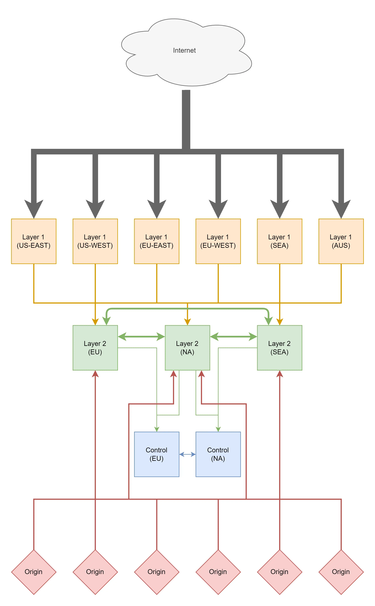

# CDN Edge Design

On this diagram the arrow points in the direction of who instantiated the request. The thickness represents how much bandwidth there is.

## Internet

The internet is where all incoming requests will come from. When a viewer requests a video segment from us this is where the request lifecycle starts.

## Layer 1

Layer 1 is the first port of entry, all users will talk to a layer 1 cache server. 

Layer 1 cache servers will have very high outgoing bandwidth. This is because most if not all of the files we serve will be cache hits, since everyone gets the same video files. However we will have to serve a large amount of people therefore we will need a lot of bandwidth at the edge of our network.

Layer 1 servers are going to be everywhere, in every region and multiple cities in each region. This is because we want to serve the people as close as possible.

Layer 1 servers will connect to 2 unique layer 2 servers. This is to provide redundancy if incase a layer 2 server goes down. 

## Layer 2

Layer 2 servers will act as a 2nd cache layer and will relay instructions to the layer 1 servers recieved from the control servers.

Layer 2 servers will connect to one layer 2 server in each region (ie, if we have 3x layer 2 server in NA and 3x layer 2 servers, each layer 2 server in NA will connect to 1 layer 2 server in EU and vice-versa)

Layer 2 will also act as a router. If we recieve a request from a layer 1 server to go to an origin and the layer 2 server does not have the data. If the layer 2 server can fetch the data from an origin it will be routed to said origin, if it cannot then the request will be routed to the layer 2 server which has an origin attached and then the origin will recieve the request. 

In terms of network hops.
- Layer 1 (cache miss)
- Layer 2 (cache miss)
- Layer 2 (cache miss & no direct connecton)
- Origin (source of truth)

If layer 2 in hop 2 has a direct connection to the origin we will route directly to hop 4 (skipping over hop 3).

## Control

The control servers will act as the state of the system. They will contain all the information about what routes exist in the network. They will also act as a authentication and state management server for the layer 2 servers which will in turn act as a manager for layer 1 servers.

Control servers are completely isolated from the request lifecycle and therefore do not a large bandwidth pipe.

## Origin 

Origin servers will be the source of truth for all the data. If all layers above cache miss the origin will provide a fresh copy of the data for the layers above to use.

## FAQ

### __What is this?__

_You may have realized this is a very simple CDN setup similar to that of Cloudflare or Fastly or any other large CDN as a service provider._

### __Why build your own if there are very cheap and cost effective solutions that exist?__

_Well, they are not very cheap when you start looking at them at scale. They become extremely expensive and add up very fast._

### __What makes this solution special?__

_This edge cache will be designed to taylor to specific needs of a video edge cache, and will have unique features which improve performance that other providers do not have._

## Unique Features

- Event stream updates from Origin. (uncache a file when it changes and push the file everywhere)
- Push to edge (pre-push a file to edge before its requested)
- Request coalescing (merge multiple requests into a single request)
- Websocket/Stream coalescing (merge multiple websockets/streams into a single stream connection)
