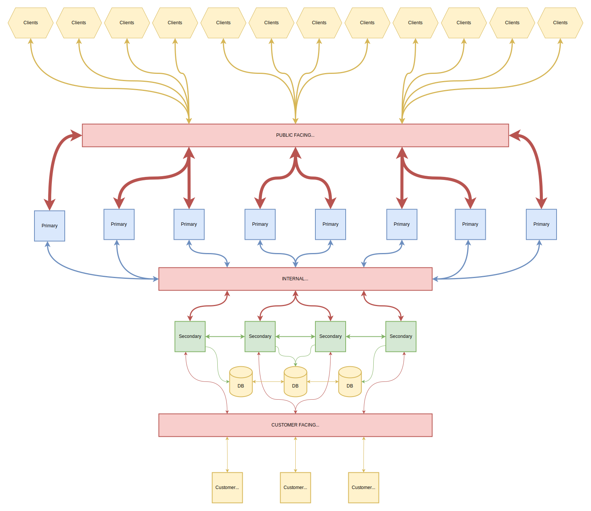
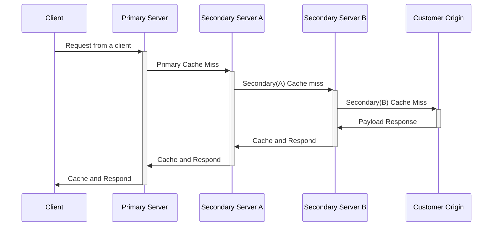
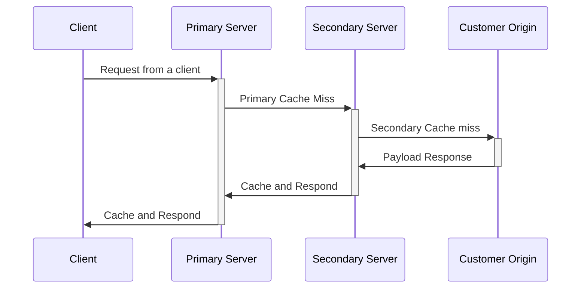
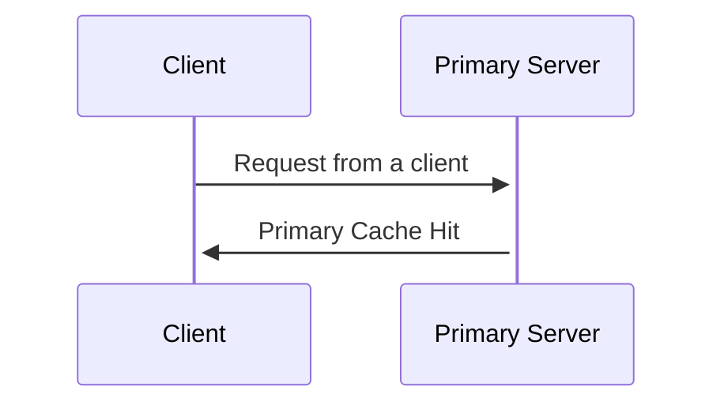
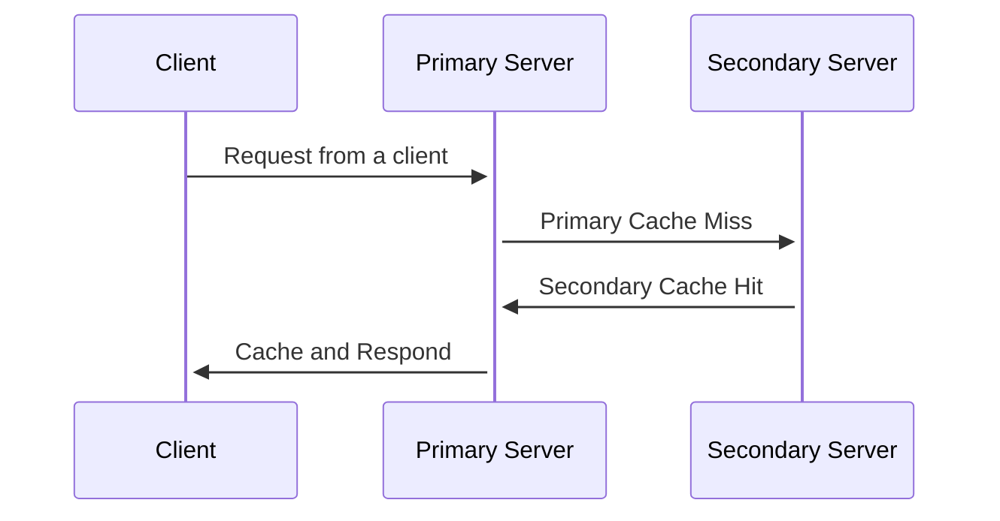

# Scuffle CDN Design

The diagram above presents the components of the Scuffle CDN system. Let's explore each component in detail:

## Clients

Clients represent the end-users of the CDN, making content requests. The CDN's role is to efficiently serve these requests.

## Public Facing ANYCAST IP

This IP, advertised globally via BGP, is what clients connect to. By broadcasting from multiple global locations, we ensure clients connect to their nearest point, optimizing latency and performance. Anycast's inherent design also enhances reliability; if one location fails, traffic reroutes to the next nearest point, ensuring high availability.

## Primary

The primary server is the initial point of contact for clients, handling the initial connection, including protocol termination. It fetches TLS certificates and settings from secondary servers. On client connection, the primary server checks for cached responses. If absent, it forwards the request to secondary servers using the Internal ANYCAST IP, caches the received response, and serves the client. These primary servers, distributed globally, handle the bulk of the traffic.

### Protocol Termination

#### DISCLAIMER: This protocol has not yet been designed, only theorized.

We employ a custom internal protocol, optimized over standard client protocols like HTTP, WebSocket, and WebRTC. The primary server terminates the client's protocol, translates it to our internal protocol, and forwards the request to the nearest secondary server using the Internal ANYCAST IP.

## Internal ANYCAST IP

This IP, used for primary-secondary server communication, is advertised within our internal network via BGP. It ensures the primary server connects to its nearest secondary server, optimizing internal latency and performance. Anycast's design ensures traffic rerouting in case of location failures.

## Secondary

Secondary servers act as the reference point for primary servers, supplying them with TLS certificates and settings. They maintain a real-time routing table of all connected secondary servers and broadcast updates. On receiving a request from a primary server, the secondary server checks its cache. If a cached response is unavailable, it forwards the request to the customer origin, caches the received response, and serves the primary server. These servers, fewer in number than primary servers, are strategically located worldwide.

## Request Lifecycle

The request lifecycle varies based on the connection of the client origin:

If the client origin connects directly to the associated secondary server:

Cache hits lead to immediate responses:

or

## Database

Located adjacent to the secondary servers, our database solution is [CockroachDB](https://www.cockroachlabs.com/). It's chosen for its open-source nature, self-hosting capabilities, and scalability. Its PostgreSQL-compatible API and robust distributed SQL engine facilitate operations.

## Customer Facing ANYCAST IP

This IP, which customer origins connect to, is advertised globally via BGP. By broadcasting from multiple global locations, we ensure customer origins connect to their nearest point, optimizing latency and performance. Anycast's design also enhances reliability; if one location fails, customer origins reroute to the next nearest point, ensuring high availability.

## Customer Origin

Customer origins serve as the definitive source for the CDN. They provide content to the CDN, which in turn serves the clients. These origins connect directly to the secondary servers and are typically located in a single region, handling only requests from secondary servers due to their limited bandwidth.

## Custom Protocol

Traditionally, services exposed to the internet rely on tools like load balancers or reverse proxies. These handle tasks such as TLS termination, traffic routing, failover, and ensuring high availability. Major cloud providers, like AWS and Google Cloud, have specialized services for this purpose.

Our protocol, however, offers a transformative approach. Designed as a tunneling protocol, it exposes services to the internet without necessitating open firewall ports or traditional load balancers and reverse proxies. Crucially, it manages TLS termination right at the application level, guaranteeing end-to-end encryption, and efficiently handles traffic routing, failover, and high availability.

### Embedded Application Integration

One of the protocol's distinguishing features is its embeddability directly within applications. This integration means that irrespective of the programming language used—Rust, Go, Python, Java, etc.—our protocol and edge servers address all concerns, from TLS to routing, from within the application itself.

This embedded approach streamlines communication. Instead of routing through an intermediary (like a traditional load balancer or reverse proxy) before reaching our CDN, your application communicates directly with our CDN edge. This direct pathway minimizes latency, reduces hops, and optimizes performance.

### QUIC Integration

A cornerstone of our protocol is the incorporation of the QUIC protocol, a cutting-edge transport protocol pioneered by Google. QUIC, built on UDP, prioritizes security, multiplexing, and low latency. It's also foundational for HTTP/3. By forging a QUIC connection from the `Customer Origin` to the `Secondary` servers, we ensure that incoming traffic is channeled directly to the `Customer Origin`.

### Legacy Support

While our vision is to transition away from HTTP as a primary transport to Customer Origins, we recognize the importance of legacy systems. To that end, we'll offer a translation service, converting our protocol back into HTTP, thereby acting as a reverse proxy for legacy applications. This approach would act as a drop in replacement for existing reverse proxy solutions such as Nginx or HAProxy. We would also support a Kubernetes Ingress Controller, allowing for seamless integration with Kubernetes.

### WebSockets Reimagined

We've rethought the traditional approach to protocols like WebSocket, breaking them down into their elemental components:

- The initial handshake
- RPC Style Messages
- Subscription Messages

In conventional CDN solutions, WebSocket is a black box, piped straight to the Customer Origin. But by dissecting WebSocket, we can tailor the protocol for specific use cases, such as consolidating subscriptions to reduce load on the customer origin.

Moreover, this approach negates the need for a persistent connection between clients and the customer origin. Messages from clients are transmitted over QUIC streams, multiplexed over a singular QUIC connection. This is not only resource-efficient but also alleviates the challenges of scaling WebSocket connections.

#### Example

##### WebSocket Handshake

1. **Client Connection**: A client initiates a WebSocket connection to the CDN.
2. **CDN to Origin Notification**: The CDN sends a message to the customer origin, notifying it of the new WebSocket connection. This message includes essential client identification details, such as headers and IP address.
3. **Origin Response**:
   - The customer origin sends back an optional response for the client.
   - It provides metadata to attach to the connection (e.g., user ID or session ID for authentication).
   - It specifies a list of subscriptions for the client.
     1. If the CDN isn't already subscribed to the provided subscriptions, it sends a subscription request to the customer origin.
     2. The customer origin then forwards subscription messages to the CDN, which in turn relays them to the client and any other clients subscribed to the same topics.

##### WebSocket Message

1. **Client Message**: A client dispatches a message to the CDN.
2. **CDN to Origin Notification**: The CDN informs the customer origin of the received WebSocket message, providing the connection's metadata, the message content, and any client subscriptions.
3. **Origin Response**: The customer origin can:
   - Send an optional response back to the client.
   - Suggest additional metadata modifications.
   - Provide new subscriptions or unsubscribing from existing ones.

##### WebSocket Close

1. **Client Disconnection**: A client terminates its WebSocket connection to the CDN.
2. **CDN to Origin Notification**: The CDN communicates to the customer origin about the closed WebSocket connection, supplying the connection's metadata and the close code.
3. **Origin's Decision**: The customer origin instructs the CDN to either:
   - Close the connection immediately.
   - Pause for a specified duration to anticipate a potential client reconnect. If the client reconnects within this window, the connection resumes, retaining its metadata and subscriptions. Any messages that arrived during the disconnection are queued and forwarded to the client upon reconnection.

### Stateless Customer Origin

A notable advantage of this design is the shift of state management from the customer origin to our edge servers. This means even if you restart your origins, the WebSocket connection remains uninterrupted on the client side. The edge server simply re-establishes its connection to the origin and resumes the session. Consequently, a single WebSocket might interact with multiple origins during its lifecycle, offering a more adaptable and scalable architecture.

### Broadening Protocol Support

While WebSocket is our initial focus, our vision encompasses support for a myriad of other protocols, including [WebRTC](https://webrtc.org/), [HTTP/3 Web Transport](https://www.ietf.org/archive/id/draft-ietf-webtrans-http3-02.html), [RTMP](https://en.wikipedia.org/wiki/Real-Time_Messaging_Protocol), [SRT](https://en.wikipedia.org/wiki/Secure_Reliable_Transport), [Warp (MOQ)](https://github.com/moq-wg/moq-transport), and more.
