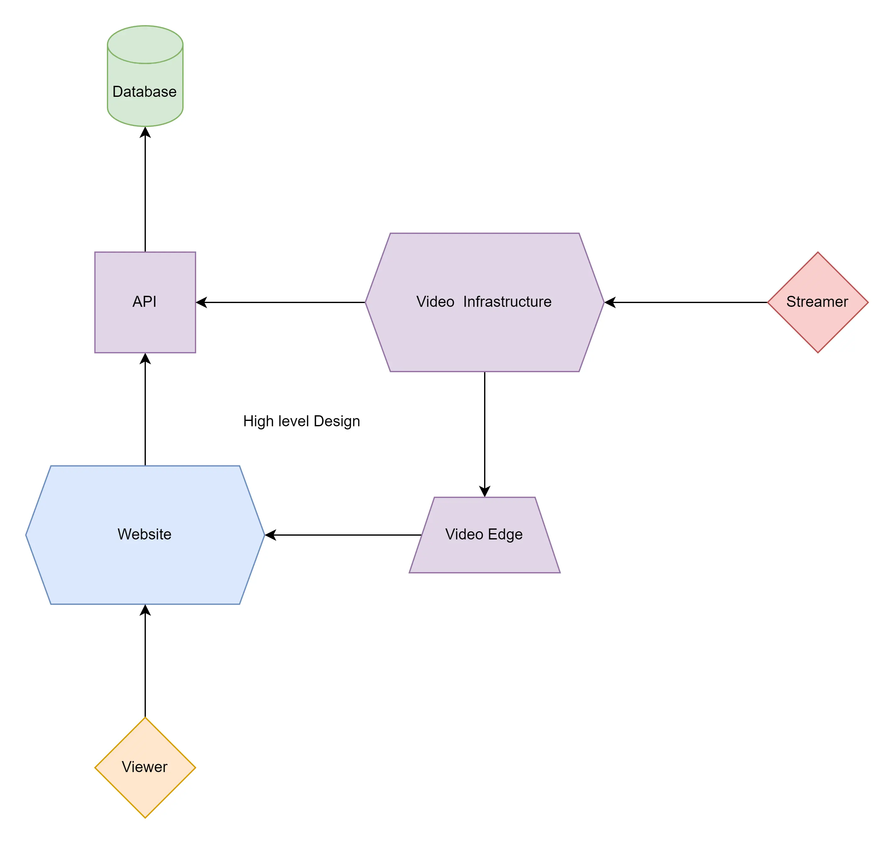

# High Level Design

At a very high level, a viewer goes to the website, the website fetches data from the API, and then if they watch a stream the website also fetches the stream from the video edge.

When a Streamer goes live, they hit the video infrastructure, and then some API Calls are pushed by them to the video edge, where the viewers can pick it up and watch the stream

You can check out the [video infrastructure flowchart](./video-infrastructure.md) for a more in-depth understanding.
