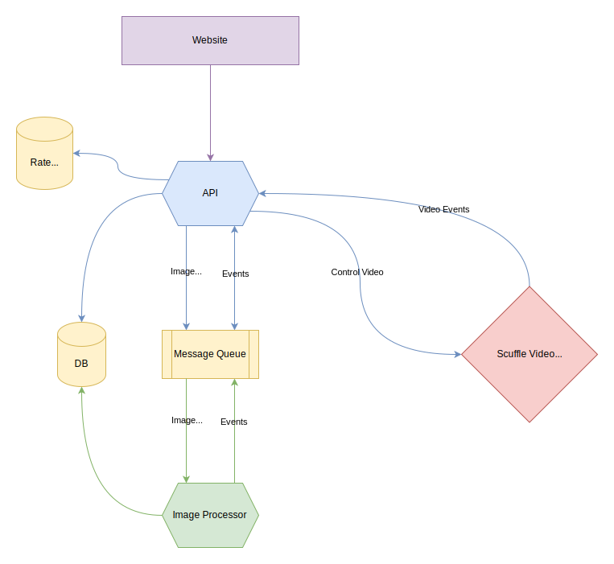

# Scuffle Platform Design

The diagram above illustrates the components of the Scuffle Platform system. Let's delve into each component:

## API

The API manages all website requests. We've implemented a [GraphQL API](../../schema.graphql) that supports subscriptions, enabling real-time updates. Additionally, the API interfaces with the [Scuffle Video API](../video/README.md) to initiate new rooms and retrieve room details.

## Website

Crafted using [Svelte](https://svelte.dev/), the website is in charge of UI rendering and user interaction management. It incorporates the video player from [Scuffle Video](../video/README.md).

## Image Processor

The image processor oversees image processing tasks. It's instrumental in generating user avatars, offline banners, emotes, and other user-uploaded images.

## Scuffle Video API

The [Scuffle Video API](../video/README.md) operates as a distinct service from the platform, dedicated to all video-related functionalities. Communication with this API is facilitated through a [gRPC](../../proto) interface.

This API also notifies us regarding room status changes (going live or offline), enabling real-time website updates.

### Message Queue

[NATs](https://nats.io) is our chosen message queue, prized for its open-source nature, self-hosting capability, and scalability in distributed settings. We leverage the JetStream feature of NATs to ensure a durable message queue.

### Database

Our database solution is [CockroachDB](https://www.cockroachlabs.com/). Its open-source status, self-hosting ability, and ease of scalability in distributed environments make it a preferred choice. Its PostgreSQL-compatible API simplifies its use, and its robust distributed SQL engine supports seamless sharding, replication, and querying.

### Rate Limiter

For rate limiting, we utilize [Redis](https://redis.io) combined with a custom Lua script. Redis's open-source nature, self-hosting capability, and scalability in distributed settings make it a suitable choice. Its robust Lua scripting engine lets us implement our rate limiter directly within Redis.
