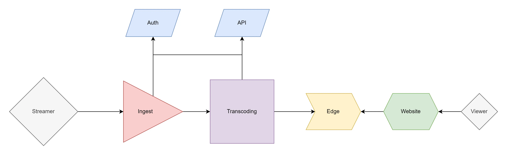

# Video Infrastructure Design

When a streamer goes live, they hit the first microservice called ingest.

## Ingest

Ingest is responsible for handling the incoming go live requests.

It is agnostic to the protocol used by the streamer to go live; for example, we can support the following:

- [WebRTC](https://en.wikipedia.org/wiki/WebRTC)
- [SRT](https://en.wikipedia.org/wiki/Secure_Reliable_Transport)
- [RTMP](https://en.wikipedia.org/wiki/Real-Time_Messaging_Protocol)

Once we get a new stream request, we need to figure out who went live. What channel is the corresponding stream request for (authentication), and what features does the requested stream have access to?

We make an API call to the auth server to validate the incoming stream and then make some API calls to create a stream target.

Once everything passes, and we are all ready and set, we ingest the stream and convert it to an SRT stream.

We can pass the stream to other optional or future ideas (such as transcription or image detection).

We then push the newly ingested stream onto the next stage: Transcoding.

## Transcoding

In the transcoding stage, we fetch the stream from the ingest service and create video variants.

We can transcode it down into `1080p`, `720p`, `480p`, or lower depending on the stream's specific requirements and features.

Transcoding is critical stage of the pipeline, since we can significantly reduce the file size of the video by compressing it, which in turn can help provide viewers a better experience and also allows us to save a lot of money on bandwidth costs. We would use a video codec such as [H264](https://en.wikipedia.org/wiki/Advanced_Video_Coding), [VP8](https://en.wikipedia.org/wiki/VP8), [VP9](https://en.wikipedia.org/wiki/VP9) or [AV1](https://en.wikipedia.org/wiki/AV1).

We can also decrease the image quality for viewers with slower connections or smaller displays. If the viewer has a slower connection, we still want to provide them with a stream to watch and to do this; We need to be able to provide a lower-quality stream for them. Or if they have a smaller display providing a higher resolution stream does not make any difference and can sometimes look worse.

### Video Codecs

There are a few video codes mentioned in the above paragraph. Generally, H264 has been the golden standard for most, if not all, of live video for a very long time due to a large amount of client support. However, AV1 provides much better quality per-bit compression. On average, it results in about 50% smaller files. So an 8k bitrate in H264 would be a 4k bitrate stream in AV1. This allows us to ship higher-quality video to viewers with slower internet speeds and also allows us to save a lot of money in CDN caching and bandwidth costs. However, AV1 is much harder to transcode than H264. So transcoding becomes a higher cost.

## Edge

We will have many servers in multiple regions worldwide, like Europe, North America, South America, South East Asia, Australia, and Africa.

These servers will cache the video locally so that viewers from those regions can get the lowest latency to broadcast possible.

Caching the video locally also means that viewers can watch at a higher quality since the bandwidth will be local and is likely to be faster & cheaper than international bandwidth.

Edge is a rather complex system designed to do these functions efficiently, reliably, and cost-effectively. So for that reason, there is a [separate flowchart diagram for edge](./cdn-edge.md).

## Website

The website will have a video player which will be able to playback the stream in the requested quality.

## Useful links

### Transport Protocols

- [What is WebRTC?](https://bloggeek.me/what-is-webrtc/)
- [What is SRT?](https://www.matrox.com/en/video/media/guides-articles/srt-protocol)
- [What is RTMP?](https://www.dacast.com/blog/rtmp-real-time-messaging-protocol)

### Video Codecs

- [What is H264?](https://www.haivision.com/resources/streaming-video-definitions/h-264)
- [What is VP8?](https://trueconf.com/blog/wiki/vp8-video-codec)
- [What is VP9?](https://www.wowza.com/blog/vp9-codec-googles-open-source-technology-explained)
- [What is AV1?](https://www.androidauthority.com/av1-codec-1113318)
- [H264 vs AV1](https://www.winxdvd.com/convert-hevc-video/av1-vs-hevc.htm)
- [VP9 vs AV1](https://www.winxdvd.com/video-transcoder/av1-vs-vp9.htm)
- [AV1 ASIC Encoding](https://netint.com/)
