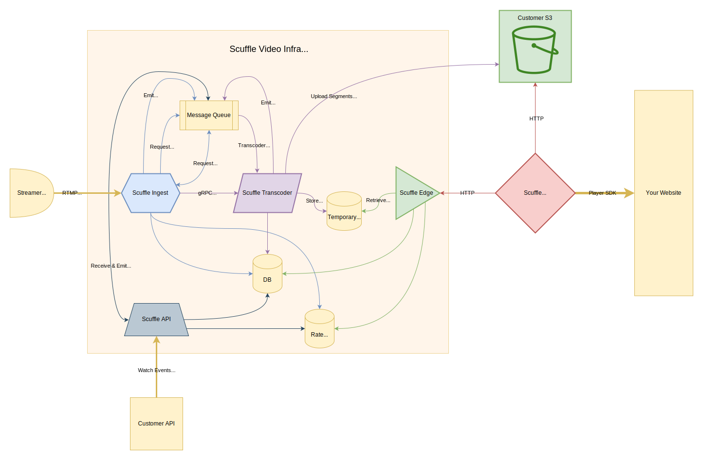

# Scuffle Video System Design

The diagram above illustrates the components of the Scuffle Video system. Let's delve into each component:

## Message Queue

We employ [NATs](https://nats.io) for our message queue due to its open-source nature, self-hosting capability, and scalability in distributed settings. The JetStream feature of NATs ensures a durable message queue.

## Database

Our choice for the database is [CockroachDB](https://www.cockroachlabs.com/). We favor CockroachDB because of its open-source status, self-hosting ability, and ease of scalability in a distributed environment. Its PostgreSQL-compatible API simplifies its use, and its advanced distributed SQL engine supports sharding and replication seamlessly.

## Temporary Cache

[NATs](https://nats.io/) serves as our memory cache. Its Object Store and Key Value store features enable us to temporarily store segments and manifests either in memory or on disk. This setup facilitates efficient caching of segments and manifests.

## Rate Limiter

For rate limiting, we utilize [Redis](https://redis.io) combined with a custom Lua script. Redis's open-source nature, self-hosting capability, and scalability in distributed settings make it a suitable choice. Its robust Lua scripting engine lets us implement our rate limiter directly within Redis.

## Custom S3

Our Video API offers a custom S3 upload endpoint for recordings. By default, every organization gets a managed S3 endpoint, which is used if no specific S3 configuration is provided. We implement [MinIO](https://min.io/) for our S3 needs due to its open-source nature, self-hosting ability, and scalability in distributed environments.

## Ingest

The Ingest component manages incoming go-live requests. It remains protocol-agnostic for streamers going live, supporting:

- [RTMP](https://en.wikipedia.org/wiki/Real-Time_Messaging_Protocol) (Currently)
- [WebRTC](https://en.wikipedia.org/wiki/WebRTC) (Planned)
- [SRT](https://en.wikipedia.org/wiki/Secure_Reliable_Transport) (Planned)
- [WARP/MOQ](https://github.com/moq-wg) (Planned - Awaiting standardization)

The go-live process involves:

1. Authenticating the streamer using their stream key upon receiving a new stream request.
2. Validating the room for the live stream, initiating a new transcoder job, and enqueuing it in our message broker.
3. The transcoder, upon picking the message, connects directly to the ingest to receive and transcode the stream.
4. The room is announced live, allowing viewers to watch the stream.

### Supported Codecs

Currently, we support:

- [H264](https://en.wikipedia.org/wiki/Advanced_Video_Coding)
- [H265](https://en.wikipedia.org/wiki/High_Efficiency_Video_Coding)
- [AV1](https://en.wikipedia.org/wiki/AV1)
- [AAC](https://en.wikipedia.org/wiki/Advanced_Audio_Coding)

These codecs align with the [RTMP protocol](https://en.wikipedia.org/wiki/Real-Time_Messaging_Protocol) and the [Extended RTMP Protocol](https://github.com/veovera/enhanced-rtmp). We plan to expand our codec support in line with other protocols in the future.

## Transcoder

Once a job is enqueued in the message broker, the transcoder retrieves it, connects to the ingest, and processes the stream. The transcoder adjusts the stream to various bitrates and resolutions as specified by the TranscodingConfig linked to the room. If a RecordingConfig is associated with the room, the transcoder also uploads the stream to S3. Periodically, the transcoder captures stream screenshots for thumbnails. If recording is enabled, these thumbnails are saved to S3, facilitating video player seeking.

### Supported Codecs

Currently, we support transcoding for:

- [H264](https://en.wikipedia.org/wiki/Advanced_Video_Coding)
- [AAC](https://en.wikipedia.org/wiki/Advanced_Audio_Coding)

Transcoding is resource-intensive, so we've limited our current support to manage costs. However, we're looking to include more codecs, like AV1 and Opus, in the future.

#### Why AV1?

AV1 offers superior quality per-bit compression, resulting in files about 50% smaller than H264. This efficiency allows us to deliver high-quality video to viewers with slower internet speeds and reduces CDN caching and bandwidth costs. However, AV1's transcoding demands are higher than H264, necessitating specialized hardware for efficient processing.

#### Why not VP8 or VP9?

While VP8 is still in use, it's less favored in the industry. VP8/VP9 lacks GPU support, making transcoding expensive. Given the cost similarity between VP8/VP9 and AV1 hardware, AV1's superior codec makes it a more logical choice.

## Edge

Edge serves as the entry point for the video player. When a player seeks to playback a room or recording, it connects to Edge to request a playback session. These sessions are unique per view and can be authenticated. The player can then download video segments for the specified room or recording. Playback sessions can be revoked anytime via the Video API.

Playback employs LL-HLS with some out-of-spec optimizations, but we also maintain a spec-compliant mode for third-party players.

### Why HLS?

HLS is widely supported across browsers and devices, easy to implement, and scalable. While traditional HLS has latency issues, LL-HLS introduces optimizations to reduce this latency, achieving around 0.5 seconds in our implementation.

### Why not WebRTC or SRT?

WebRTC prioritizes latency over quality, making it less suitable for 1-to-many streaming. Its scalability and caching challenges also add to the complexity. SRT, on the other hand, isn't supported by major browsers. We do, however, plan to support both in the future.

### What about WARP / MOQ?

WARP/MOQ, developed by Twitch to enhance HLS latency, is on our radar for future support. Its implementation will follow our development of a custom CDN infrastructure.

### Recording Playback

Edge doesn't store recordings directly. Instead, it provides the S3 Bucket URL, allowing the player to fetch segments directly from S3.

### Room Playback

For live/real-time playback, Edge serves as a memory cache proxy. If DVR is enabled, Edge employs a hybrid approach, fetching recent segments from memory and older ones from S3.

## Player

Our custom video player is crafted from scratch in Rust using Web Assembly. We leverage Rust's platform-agnostic capabilities to reuse many server-side video libraries. While our player is tailored for our Edge API, it can potentially be extended as a standalone HLS player.

## Video Libraries

At Scuffle, we've developed several Rust video libraries:

- [h264](../../video/lib/h264) - H264 header decoder
- [h265](../../video/lib/h265) - H265 header decoder
- [av1](../../video/lib/av1) - AV1 header decoder
- [aac](../../video/lib/aac) - AAC header decoder
- [mp4](../../video/lib/mp4) - MP4 muxer/demuxer
- [flv](../../video/lib/flv) - FLV demuxer
- [rtmp](../../video/lib/rtmp) - RTMP protocol with Extended RTMP Protocol support
- [transmuxer](../../video/lib/transmuxer) - Transmuxer for FLV to MP4 conversion
- [amf0](../../video/lib/amf0) - AMF0 encoder/decoder
- [exp_golomb](../../video/lib/exp_golomb) - Exp golomb encoder/decoder

For video transcoding, we utilize [ffmpeg](https://ffmpeg.org/).
