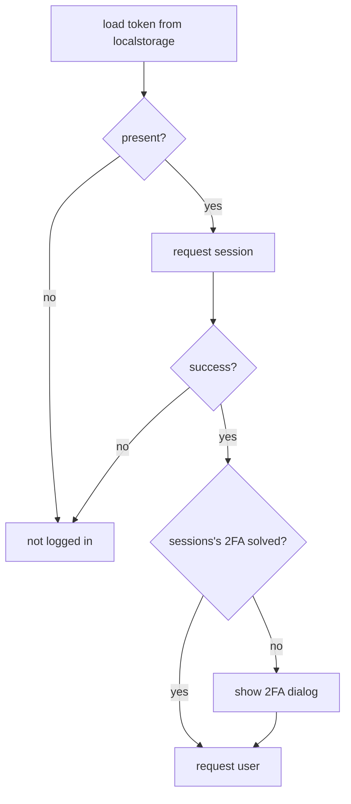

# Client-Side Auth Flow

## On Initial Page Load

```mermaid
flowchart TD
    A[load token from localstorage] --> B{present?}
    B -->|no| C[not logged in]
    B -->|yes| D[request session]
    D --> E{success?}
    E -->|no| C[not logged in]
    E -->|yes| F{sessions's 2FA solved?}
    F -->|no| G[show 2FA dialog]
    F -->|yes| H[request user]
    G --> H
```
